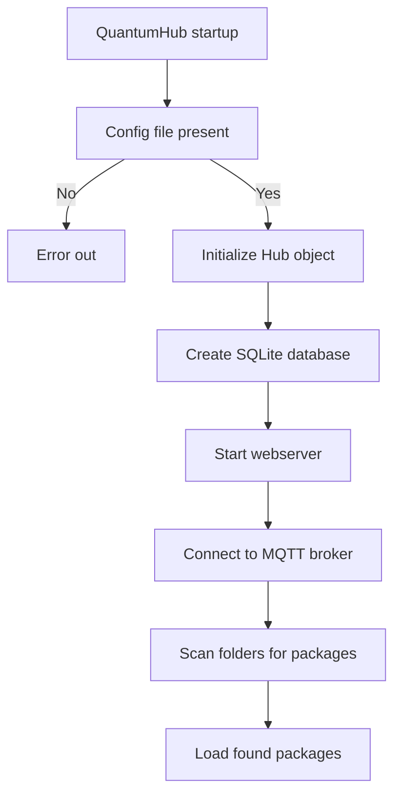

```mermaid
flowchart TD
    n1["QuantumHub startup"] --> n2["Config file present"]
    n2 -- No --> n3["Error out"]
    n2 -- Yes --> n4["Initialize Hub object"]
    n4 --> n6["Create SQLite database"]
    n6 --> n5["Start webserver"]
    n7["Connect to MQTT broker"] --> n8["Scan folders for packages"]
    n5 --> n7
    n8 --> n9["Load found packages"]


```